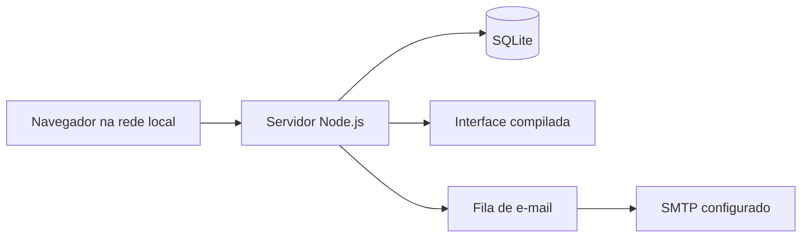

# VOLTS COG

### Projeto Sistema Interno para Empresas

**Gestão operacional integrada · Projeto de [Lucas Cerbaro Aguiar](https://github.com/Aguirato)**

Aplicação web para centralizar a rotina de uma empresa de automação e manutenção elétrica: registros operacionais, leituras de usinas, veículos, chaves, suporte técnico e relatórios.

**React · TypeScript · Node.js · SQLite · Recharts**


> Código-fonte e apresentação publicados para portfólio, sob **licença proprietária** de Lucas Cerbaro Aguiar. As imagens usam dados fictícios. Bancos, históricos, contas, credenciais e configurações reais da empresa não integram esta publicação. A visibilidade pública permite conhecer o projeto; as condições de uso estão em [LICENSE](LICENSE).

## O problema

Uma operação precisa saber quem está com um veículo ou chave, quais manutenções estão pendentes, o que aconteceu em uma usina e quais medições foram registradas em cada turno. Informações dispersas dificultam consultar o histórico e preparar relatórios.

## A solução

O VOLTS COG reúne esses controles em uma aplicação acessada pelo navegador, com usuários, permissões e histórico centralizados. A interface mantém a identidade visual preta e amarela da VOLTS.

| Módulo | Funcionalidades |
| --- | --- |
| Visão geral | Resumos da operação, anormalidades e mural de recados. |
| Diário de operação | Rotinas e ocorrências por usina, data/hora e autor. |
| Leituras manuais | Modelos de medições específicos por usina e unidade geradora. |
| Frota | Veículos, responsáveis, manutenção, observações e histórico. |
| Registro de chaves | Cadastro, retirada, devolução, responsável e previsão de retorno. |
| Suporte técnico | Solicitações, responsáveis, andamento e notificações por e-mail. |
| Relatórios | Filtros por período e pessoa, exportação CSV e impressão/PDF. |
| Administração | Usuários, permissões, usinas, unidades geradoras e configuração SMTP. |

## Interface em funcionamento

### Controle de frota

Visão dos veículos e de sua situação de manutenção, com pesquisa e responsáveis.


### Registro de chaves

Controle das chaves disponíveis e retiradas, com histórico das movimentações.


### Relatórios e gráficos

Os relatórios respeitam o modelo de cada usina e unidade geradora. Os gráficos permitem consultar potência ao longo do tempo, temperaturas e potência em eixos separados, e temperatura × potência da mesma leitura.


As visualizações analisam leituras cadastradas manualmente. Elas não representam telemetria em tempo real nem comandam equipamentos industriais.

## Decisões de implementação

- **Consultas por período:** a tela de leituras abre nas últimas 24 horas, com até 30 registros por página. Relatórios são carregados quando o usuário solicita a consulta.
- **Preservação do histórico:** cada nova leitura guarda o modelo utilizado. Movimentações de chaves e atualizações de suporte preservam informações para consulta posterior.
- **Validações no servidor:** uma chave não pode ter duas retiradas abertas, e sua devolução não pode ser anterior à saída.
- **Controle de acesso:** sessões de usuário, senhas armazenadas com scrypt, permissões administrativas e auditoria das ações.
- **Fila de e-mail:** falhas de envio não apagam a solicitação de suporte; notificações podem ser tentadas novamente.
- **Medições consistentes:** campos vazios permanecem sem informação, zero é válido e temperaturas sem unidade confirmada não são tratadas como graus Celsius.

## Tecnologias e arquitetura

| Camada | Tecnologias |
| --- | --- |
| Interface | React, TypeScript, CSS e Vite |
| Gráficos | Recharts |
| Servidor | Node.js, JavaScript com módulos ES e API HTTP |
| Dados | SQLite, transações e migrações versionadas |
| E-mail | Nodemailer e fila persistida |
| Ambiente de operação | Servidor Windows na rede local e acesso pelo navegador |



## Código e documentação

| Pasta ou arquivo | Conteúdo |
| --- | --- |
| [frontend/](frontend/) | Código da interface React e TypeScript. |
| [server/](server/) | API, autenticação, módulos operacionais e persistência SQLite. |
| [server/migrations/](server/migrations/) | Evolução versionada do banco. |
| [public/](public/) | Interface já compilada para a instalação local. |
| [scripts/](scripts/) | Compilação da interface e verificação do pacote. |
| [assets/](assets/) | Imagens de demonstração usadas neste README. |
| [docs/](docs/) | Instalação, manutenção, licenciamento e avisos de terceiros. |
| [INICIAR.cmd](INICIAR.cmd) / [PARAR.cmd](PARAR.cmd) | Iniciar e parar uma instalação Windows configurada. |

Guias: [instalação](docs/INSTALACAO.md) · [uso do sistema](GUIA-DE-USO.md) · [backup e transferência](docs/BACKUP-E-TRANSFERENCIA.md) · [atualizar no GitHub](docs/PUBLICAR-NO-GITHUB.md) · [segurança](SECURITY.md) · [licenciamento](docs/LICENCIAMENTO.md).

## Instalação e desenvolvimento autorizados

Os procedimentos de execução e alteração destinam-se ao titular e a pessoas ou organizações com sua autorização, conforme a [licença](LICENSE). O projeto requer **Node.js 24.x**. A interface compilada está incluída; o [guia de instalação](docs/INSTALACAO.md) explica como configurar a rede, iniciar o servidor e obter a senha temporária aleatória do primeiro administrador.

Para compilar uma alteração, execute na raiz da cópia de desenvolvimento:

```powershell
npm --prefix frontend ci
npm run typecheck
npm run build
npm run verificar
```

O build atualiza `public/`. O backend JavaScript não precisa de compilação e utiliza os componentes fornecidos em `server/vendor/`, com seus avisos de licença preservados. A publicação inclui exemplos fictícios de usinas; uma instalação nova não possui registros operacionais da empresa nem uma senha fixa de administrador.

As notificações de suporte exigem SMTP configurado e o destinatário definido pela variável de ambiente `VOLTS_SUPPORT_EMAIL`. O padrão `suporte@example.invalid` é um marcador sem entrega de e-mail. Veja [a configuração de e-mail](docs/INSTALACAO.md#6-e-mail-de-suporte).

Publicar ou atualizar este repositório não modifica a instalação da empresa. GitHub Pages não executa o servidor Node.js ou o banco SQLite desta aplicação.

## Sobre esta publicação

Esta publicação documenta as funcionalidades da versão **2.3.0**. As telas usam a interface do projeto com cadastros e medições fictícios, preparados exclusivamente para demonstração. Nenhum banco, credencial, endereço interno ou histórico operacional foi incluído.

O sistema foi desenvolvido para uso na rede interna. Este repositório oferece o código e a apresentação, sem acesso à instalação da empresa. O banco e os backups da operação devem permanecer separados do GitHub.

## Autoria e direitos

**Projeto de Lucas Cerbaro Aguiar · [Perfil no GitHub](https://github.com/Aguirato)**

Todos os direitos reservados sobre os elementos próprios do código e da apresentação. Esta publicação não constitui uma licença de código aberto. A visualização e os forks permitidos pelos termos do GitHub permanecem possíveis; execução, reutilização, redistribuição e exploração comercial dependem das permissões descritas em [LICENSE](LICENSE). Bibliotecas, componentes e marcas de terceiros conservam seus respectivos direitos; veja [créditos](CREDITOS.md) e [avisos de terceiros](docs/THIRD-PARTY-NOTICES.md).
