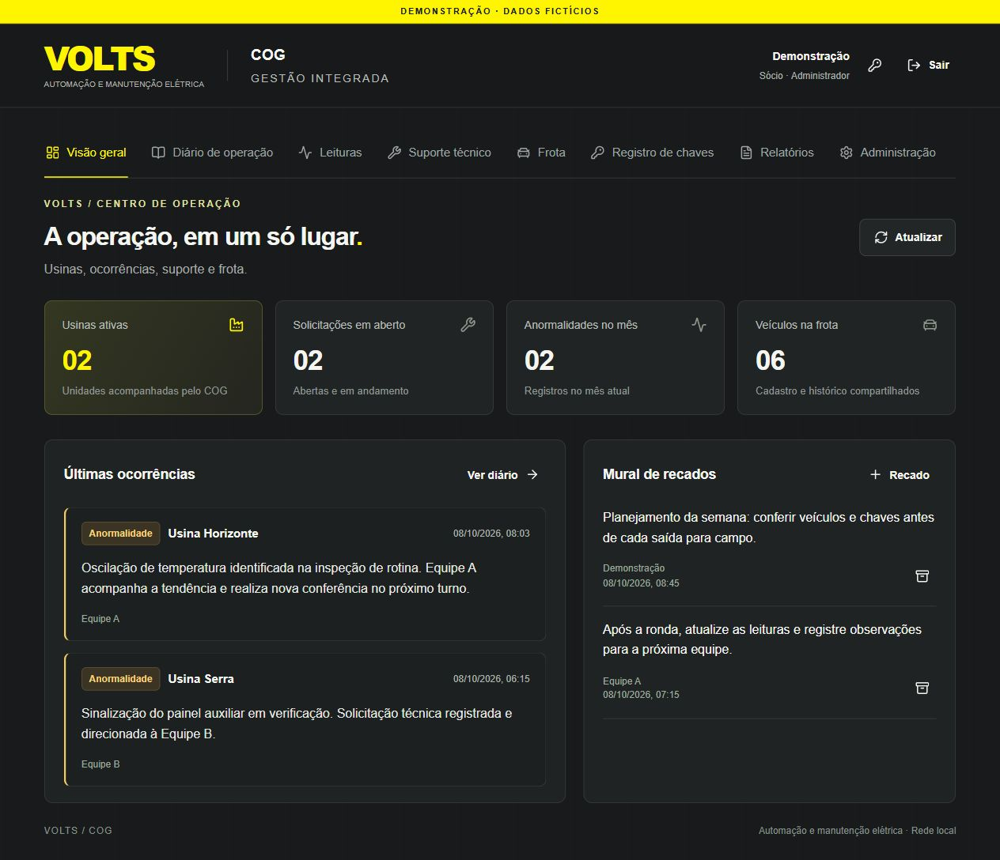
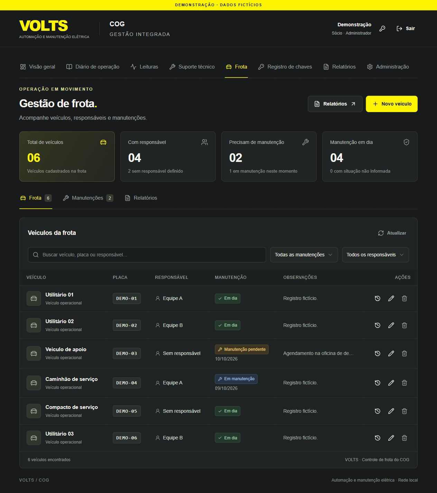
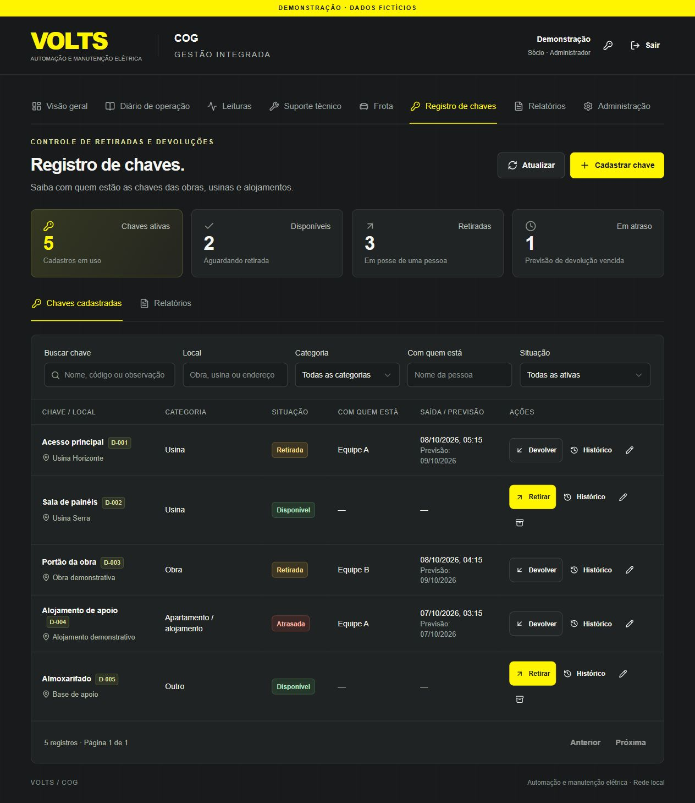
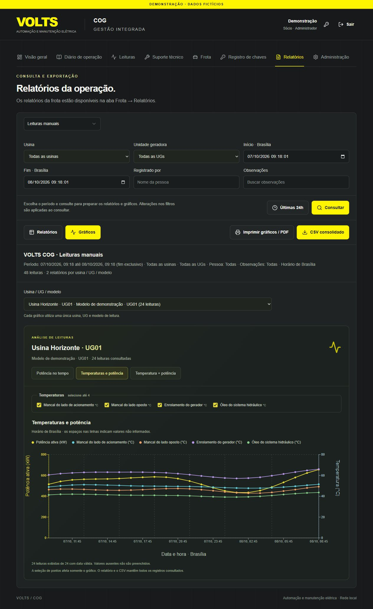
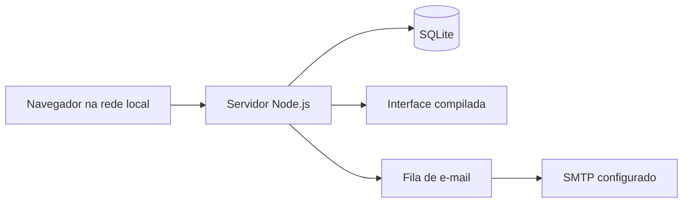

# VOLTS COG

### Projeto Sistema Interno para Empresas

**Gestão operacional integrada · Projeto de [Lucas Cerbaro Aguiar](https://github.com/Aguirato)**

Aplicação web para centralizar a rotina de uma empresa de automação e manutenção elétrica: registros operacionais, leituras de usinas, veículos, chaves, suporte técnico e relatórios.

**React · TypeScript · Node.js · SQLite · Recharts**

> Este repositório apresenta o projeto para portfólio. As imagens foram capturadas em um ambiente de demonstração com dados fictícios. O código-fonte e os dados da operação não integram esta publicação pública.

## O problema

Uma operação precisa saber quem está com um veículo ou chave, quais manutenções estão pendentes, o que aconteceu em uma usina e quais medições foram registradas em cada turno. Informações dispersas dificultam consultar o histórico e preparar relatórios.

## A solução

O VOLTS COG reúne esses controles em uma aplicação acessada pelo navegador, com usuários, permissões e histórico centralizados. A interface mantém a identidade visual preta e amarela da VOLTS.

| Módulo | Funcionalidades |
| --- | --- |
| Visão geral | Resumos da operação, anormalidades e mural de recados. |
| Diário de operação | Rotinas e ocorrências por usina, data/hora e autor. |
| Leituras manuais | Modelos de medições específicos por usina e unidade geradora. |
| Frota | Veículos, responsáveis, manutenção, observações e histórico. |
| Registro de chaves | Cadastro, retirada, devolução, responsável e previsão de retorno. |
| Suporte técnico | Solicitações, responsáveis, andamento e notificações por e-mail. |
| Relatórios | Filtros por período e pessoa, exportação CSV e impressão/PDF. |
| Administração | Usuários, permissões, usinas, unidades geradoras e configuração SMTP. |

## Interface em funcionamento

### Controle de frota

Visão dos veículos e de sua situação de manutenção, com pesquisa e responsáveis.

### Registro de chaves

Controle das chaves disponíveis e retiradas, com histórico das movimentações.

### Relatórios e gráficos

Os relatórios respeitam o modelo de cada usina e unidade geradora. Os gráficos permitem consultar potência ao longo do tempo, temperaturas e potência em eixos separados, e temperatura × potência da mesma leitura.

As visualizações analisam leituras cadastradas manualmente. Elas não representam telemetria em tempo real nem comandam equipamentos industriais.

## Decisões de implementação

- **Consultas por período:** a tela de leituras abre nas últimas 24 horas, com até 30 registros por página. Relatórios são carregados quando o usuário solicita a consulta.
- **Preservação do histórico:** cada nova leitura guarda o modelo utilizado. Movimentações de chaves e atualizações de suporte preservam informações para consulta posterior.
- **Validações no servidor:** uma chave não pode ter duas retiradas abertas, e sua devolução não pode ser anterior à saída.
- **Controle de acesso:** sessões de usuário, senhas armazenadas com scrypt, permissões administrativas e auditoria das ações.
- **Fila de e-mail:** falhas de envio não apagam a solicitação de suporte; notificações podem ser tentadas novamente.
- **Medições consistentes:** campos vazios permanecem sem informação, zero é válido e temperaturas sem unidade confirmada não são tratadas como graus Celsius.

## Tecnologias e arquitetura

| Camada | Tecnologias |
| --- | --- |
| Interface | React, TypeScript, CSS e Vite |
| Gráficos | Recharts |
| Servidor | Node.js, JavaScript com módulos ES e API HTTP |
| Dados | SQLite, transações e migrações versionadas |
| E-mail | Nodemailer e fila persistida |
| Ambiente de operação | Servidor Windows na rede local e acesso pelo navegador |

## Sobre esta apresentação

Esta publicação documenta as funcionalidades da versão **2.3.0**. As telas usam a interface do projeto com cadastros e medições fictícios, preparados exclusivamente para demonstração. Nenhum banco, credencial, endereço interno ou histórico operacional foi incluído.

O sistema completo foi desenvolvido para uso na rede interna. Este repositório é uma apresentação de portfólio e não oferece acesso à instalação da empresa.

## Autoria e direitos

**Projeto de Lucas Cerbaro Aguiar · [Perfil no GitHub](https://github.com/Aguirato)**

Todos os direitos reservados sobre os elementos próprios desta apresentação. As condições de uso estão em [LICENSE](LICENSE). Bibliotecas, componentes e marcas de terceiros conservam seus respectivos direitos; veja [créditos](CREDITOS.md).
